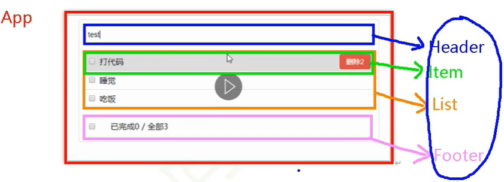
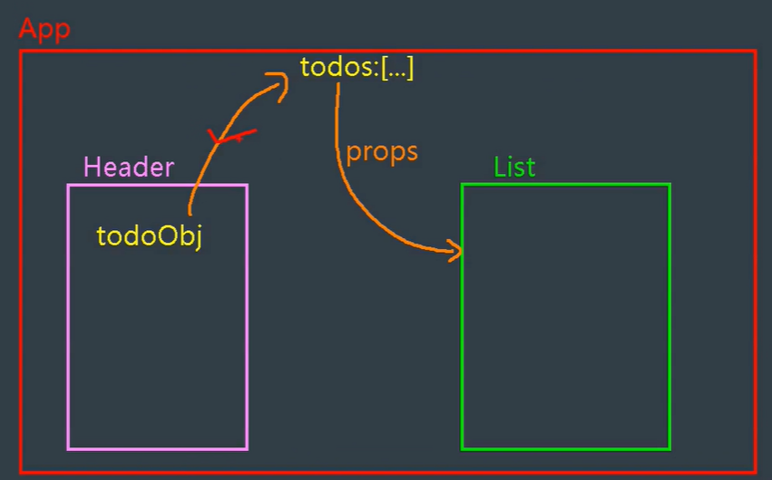
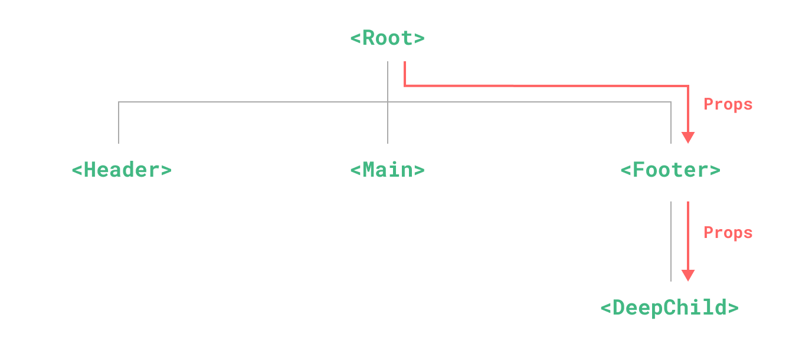
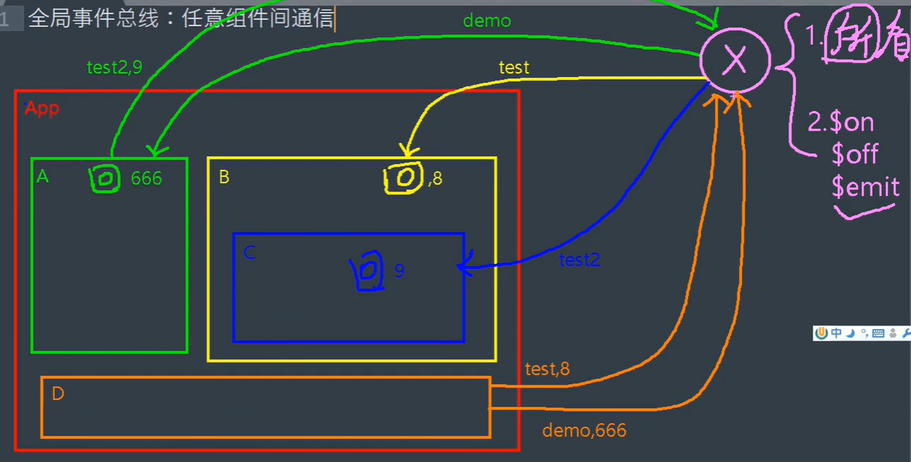

# todolist

> 使用 `vue2` 基础组件化定义的一个案例（逐步优化）
> 
> - **src_1.x**: 通过父组件给子组件传递函数类型的`props`实现：子给父传递数据
> - **src_2.x**: 通过父组件给子组件绑定一个自定义事件实现：子给父传递数据
> - **src_3.x**: 全局事件总线传递实现

**组件化编码流程**：

1. **​拆分静态组件**：组件要按照功能点拆分，命名不要与 html 元素冲突。
2. **​实现动态组件**：考虑好数据的存放位置，数据是一个组件在用，还是一些组件在用：
     1. ​一个组件在用：放在组件自身即可。
     2. ​一些组件在用：放在他们共同的父组件上（<span style="color:red">状态提升</span>）。
3. **实现交**互：从绑定事件开始。



<hr>

**props 适用于**：

1. ​父组件 ==> 子组件通信
2. ​子组件 ==> 父组件通信（要求父先给子一个函数）

> **使用 v-model 时要切记**：v-model 绑定的值不能是 props 传过来的值，因为 props 是不可以修改的！ 




<hr>

**组件的自定义事件**

1. 一种组件间通信的方式，适用于：<strong style="color:red">子组件 ===> 父组件</strong>
2. 使用场景：A是父组件，B是子组件，B想给A传数据，那么就要在A中给B绑定自定义事件（<span style="color:red">事件的回调在A中</span>）。

<hr>

## 全局事件总线（GlobalEventBus）



1. 一种组件间通信的方式，适用于<span style="color:red">任意组件间通信</span>。

2. 安装全局事件总线：

   ```js
   new Vue({
   	......
   	beforeCreate() {
   		Vue.prototype.$bus = this //安装全局事件总线，$bus就是当前应用的vm
   	},
       ......
   }) 
   ```

3. 使用事件总线：

   1. 接收数据：A组件想接收数据，则在A组件中给`$bus`绑定自定义事件，事件的<span style="color:red">回调留在A组件自身。</span>

      ```js
      methods(){
        demo(data){......}
      }
      ......
      mounted() {
        this.$bus.$on('xxxx',this.demo)
      }
      ```

   2. 提供数据：```this.$bus.$emit('xxxx',数据)```

4. 最好在`beforeDestroy`钩子中，用`$off`去解绑<span style="color:red">当前组件所用到的</span>事件。


